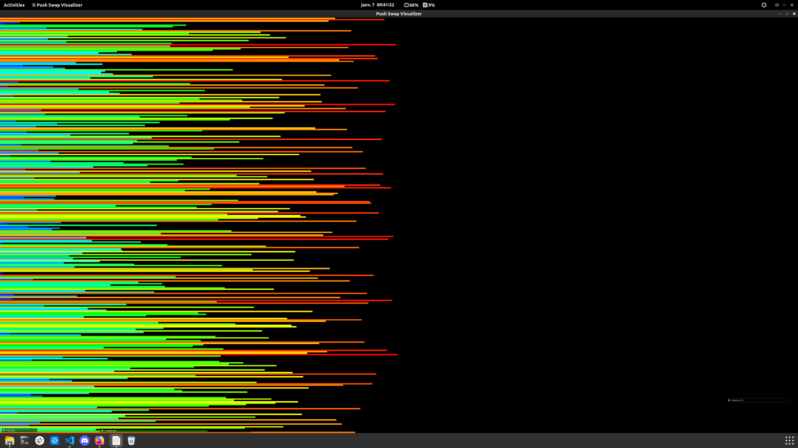
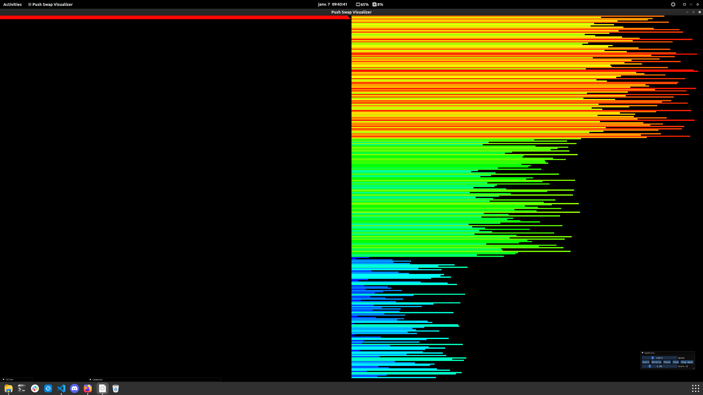
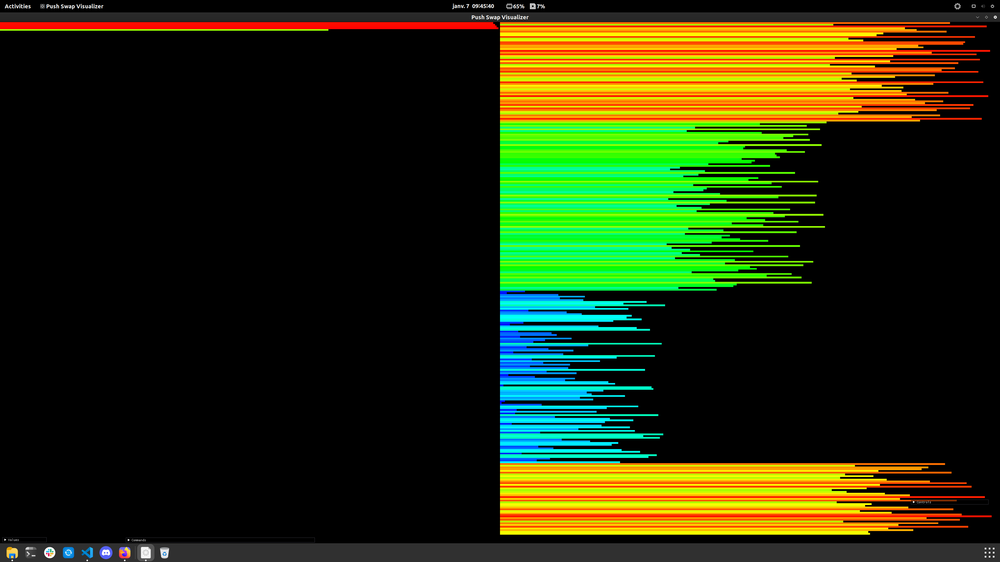

# PUSH_SWAP

**PUSH_SWAP** est un projet visant à trier une liste de n nombres avec le moins d'opérations possibles en disposant de deux listes et de seulement 8 opérations + 3 doubles.

## Liste des opérations

- **sa (swap a)** : Intervertit les 2 premiers éléments au sommet de la pile a.  
  Ne fait rien s’il n’y en a qu’un ou aucun.
  
- **sb (swap b)** : Intervertit les 2 premiers éléments au sommet de la pile b.  
  Ne fait rien s’il n’y en a qu’un ou aucun.
  
- **ss** : sa et sb en même temps.

- **pa (push a)** : Prend le premier élément au sommet de b et le met sur a.  
  Ne fait rien si b est vide.
  
- **pb (push b)** : Prend le premier élément au sommet de a et le met sur b.  
  Ne fait rien si a est vide.

- **ra (rotate a)** : Décale d’une position vers le haut tous les éléments de la pile a.  
  Le premier élément devient le dernier.
  
- **rb (rotate b)** : Décale d’une position vers le haut tous les éléments de la pile b.  
  Le premier élément devient le dernier.
  
- **rr** : ra et rb en même temps.
  
- **rra (reverse rotate a)** : Décale d’une position vers le bas tous les éléments de la pile a.  
  Le dernier élément devient le premier.
  
- **rrb (reverse rotate b)** : Décale d’une position vers le bas tous les éléments de la pile b.  
  Le dernier élément devient le premier.
  
- **rrr** : rra et rrb en même temps.

---

## Algorithme

J'ai développé mon propre algorithme de tri (pour n < 300) avec le fonctionnement suivant :

### Étape 1 : 299 valeurs aléatoires


### Étape 2 : Premier tri - Division des valeurs en deux moitiés, avec un premier tri des valeurs les plus faibles, et les trois plus grandes laissées sur la pile A.


### Étape 3 : Division de la 1ère moitié avec préparation sur la pile A et séparation de la partie en cours de tri entre le haut et le bas de la pile B pour un accès plus rapide aux valeurs.


### Étape 4 : Tri de la 1ère moitié avec le plus grand quart au-dessus et le second en dessous de la pile A.


### Étape 5 : À la fin des valeurs du 1er quart, remise du second au-dessus.


### Étape 6 : Reprise des étapes précédentes pour les deux autres quarts avant le final de la liste triée.


Pour les valeurs de n > 300, j'ai dû utiliser radix (trie les nombres bit par bit, du bit de poids faible au bit de poids fort) car ses résultats en moyenne étaient meilleurs dans ce cas.

---

## 💻 Utilisation

> **Note** : Ce projet a été réalisé sur **macOS**.

Pour compiler et exécuter le programme :

```bash
make && ./push_swap "liste de nombres"
```

Ou bien tester [ici](https://github.com/o-reo/push_swap_visualizer)
